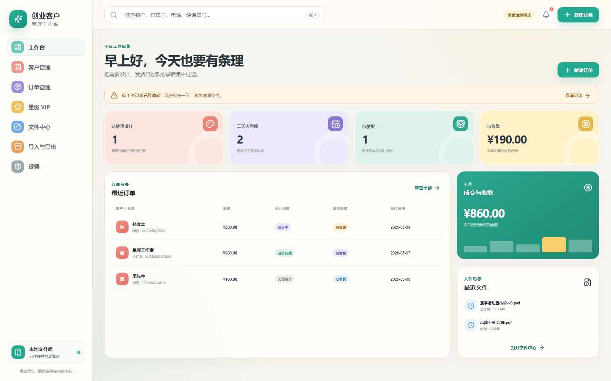

# 创业客户管理工作台

一个个人使用、离线优先的 Windows 客户与订单管理桌面 App。用于集中管理来自闲鱼、微信、淘宝、小红书等平台的客户资料、订单进度、收款、文件与 VIP 等级。



## V1 功能

- 客户档案：多个平台身份、电话、微信、地址、二维码、标签、备注、0–5 星 VIP。
- 订单管理：设计与履约双进度、截止日期、快递信息、自定义标签。
- 计价收款：设计、打印、快递与自定义明细，金额按人民币分存储，支持多次收款。
- 文件管理：首单自动创建客户与订单文件夹，拖拽或选择文件上传，同名文件不覆盖。
- 搜索提醒：搜索客户、平台网名、电话、订单号、快递单号与备注；工作台展示待办和逾期。
- 数据工具：Excel 字段映射导入、每日数据库备份、完整 ZIP 导出、备份恢复、云端只读 JSON 导出。

## 首次使用

1. 安装并打开 App。
2. 选择“客户文件库”根目录，推荐放在空间充足的数据盘。
3. 创建客户。
4. 创建该客户的第一笔订单。保存成功后，App 自动创建客户资料和订单文件夹。

客户改名后，已经生成的文件夹不会自动改名，避免文件路径失效。

## 文件与备份规则

- 上传或拖入文件时复制原文件，原位置内容保留。
- 同名文件自动生成 `(2)`、`(3)` 等版本名。
- 删除文件时先移动到客户文件库下的 `_回收站`。
- 每天启动 App 时自动备份 SQLite 数据库，最多保留最近 30 份。
- “完整数据导出”会打包数据库、设置与全部客户文件。

## 本地开发

```powershell
npm.cmd install
npm.cmd test
npm.cmd run build
cd src-tauri
cargo test
cd ..
npm.cmd run tauri:dev
```

生成 Windows 安装包：

```powershell
npm.cmd run tauri:build
```

## V1 边界

- 仅个人单机使用，不包含账号、员工权限或局域网共享。
- 不自动同步平台订单，不联网查询物流。
- 云端功能目前只提供版本化只读 JSON 导出接口，不上传数据。

