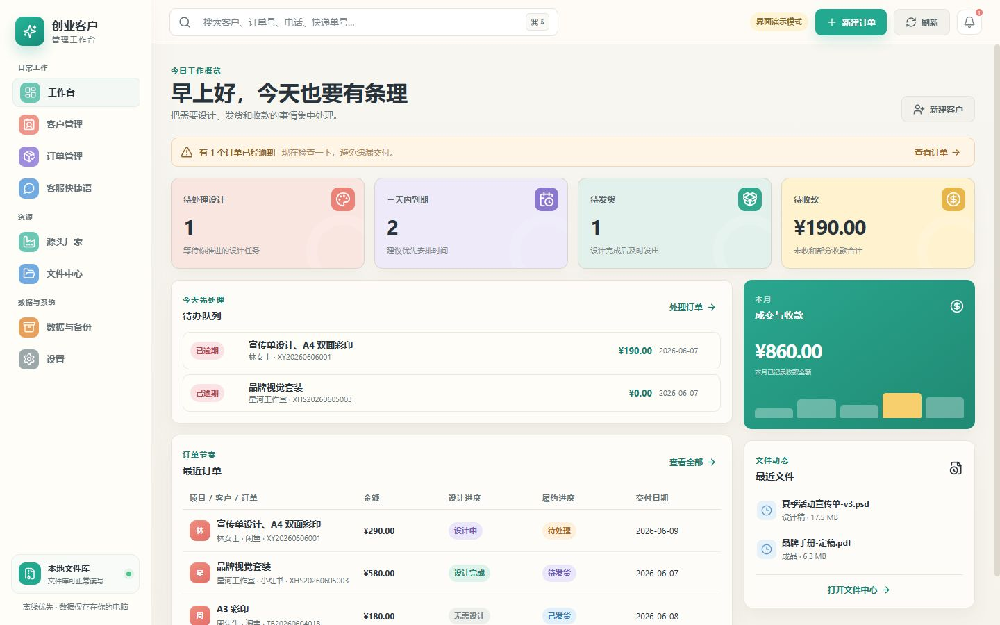

# 创业客户管理工作台

面向个人接单者的 Windows 本地客户与订单管理桌面应用。客户、订单、收款和文件都保存在自己的电脑上，无需账号，也不会自动上传业务数据。



## 主要功能

- 客户档案：电话、微信、多个平台身份、地址、二维码、标签、备注和 0–5 星等级。
- 订单流程：设计与履约双进度、设计/交付截止日、物流、收货地址、计价明细和厂家成本快照。
- 收款管理：支持多次收款、超额收款确认、错误收款删除，并自动重算已收与未收。
- 文件管理：首单建立客户文件树，拖入或选择附件，同名文件自动编号，删除先进入 `_回收站`。
- 日常效率：全局搜索、逾期/三天内到期/待收款筛选、快捷语、订单模板和源头厂家报价。
- 数据安全：每日数据库快照、完整工作区 ZIP 导出与恢复、文件库安全迁移、存储健康检查。
- 客户导入：支持 Excel、ODS 和 CSV，可选工作表、映射字段、逐行检查疑似重复项。

## 安装与升级

从发布页下载名称以 `_x64-setup.exe` 结尾的安装程序，双击后按提示安装。升级可以直接运行新版安装程序，或在应用的“设置 → 应用更新”中检查更新；数据库和客户文件库不会因正常升级被删除。

卸载应用前，建议先在“数据与备份”中创建数据库快照和完整归档。客户文件库位于你自己选择的目录，不会因为卸载应用而自动清空。

## 第一次使用

首次打开可以选择三种开始方式：

1. 新建空白工作台：选择一个可写目录作为“客户文件库”。
2. 从客户表格开始：建立文件库后直接进入客户导入向导。
3. 恢复完整工作区：检查完整 ZIP 后，把数据库和客户文件恢复到新的空目录。

创建客户后可以直接继续新建订单。第一笔订单保存成功时，应用会创建客户资料和订单文件夹；客户改名不会强制重命名已有目录，避免路径失效。

## 数据安全规则

- 数据库快照包含客户、订单、收款、设置、快捷语和自定义订单模板，不包含客户文件。
- 完整归档包含数据库、设置和客户文件，并带文件大小与 SHA-256 校验清单。
- 完整恢复会先检查归档和数据库，再创建恢复前安全备份；失败时自动回滚，原文件库保留。
- 安全迁移会复制并逐个校验文件，成功后才切换路径；旧文件库不会自动删除。
- 文件库磁盘离线或目录不可写时只显示告警，不会隐藏或软删除客户、订单记录。
- 自动和手动数据库备份使用同一个已解析目录；设置页显示最近成功时间、路径和错误。

更完整的操作步骤见 [使用说明](docs/使用说明.md)。

## 本地开发

```powershell
npm.cmd install
npm.cmd test
npm.cmd run build
cd src-tauri
cargo test --all-targets
cd ..
npm.cmd run tauri:dev
```

生成 Windows 安装包：

```powershell
npm.cmd run tauri:build
```

## 当前边界

- 面向个人单机使用，不提供员工账号、权限或多人同时编辑。
- 不自动抓取平台订单，也不联网查询物流。
- 第三方网盘同步目录会按照该网盘客户端的规则上传；应用本身不负责上传。
- “云端只读模型”只导出版本化 JSON，不执行上传或远程编辑。
